# Early Project Documents: YouTube Summarizer

Before writing a single line of code, professional developers create planning documents to clarify *what* they are building and *how* they are going to build it. This saves countless hours of rewriting code later.

Here are mock examples of the three documents you should write when starting a project like this.

---

## 1. Product Requirements Document (PRD)

*A PRD defines **what** the product is, who it's for, and exactly what features it needs to have.*

**Project Name:** YT Summarizer
**Date:** Oct 24, 2024
**Target Audience:** Students, researchers, and professionals who don't have time to watch long videos.

### **Core Objective:**
Build a web application that allows users to paste a YouTube URL and instantly receive a structured, easy-to-read AI-generated summary of the video.

### **User Stories (Features):**
- As a user, I want to paste a YouTube link into a clean, simple input box.
- As a user, I want to click a "Summarize" button and see a loading indicator so I know the system is working.
- As a user, I want to see a 1-sentence TL;DR, a paragraph summary, and a bulleted list of key takeaways.
- As a user, I want to be able to copy the summary to my clipboard with one click.
- *Edge Case:* If the video has no captions, I want an option to paste my own text transcript manually.

### **Out of Scope (For V1):**
- User accounts / Login system.
- Saving past summaries to a database.
- Summarizing videos longer than 2 hours.

---

## 2. System Architecture & Tech Stack

*This document defines **how** the system will be built technically and what tools will be used.*

### **Tech Stack Selection:**
*   **Frontend:** React.js (Vite) + Tailwind CSS (Chosen for speed of UI development).
*   **Backend:** Node.js + Express.js (Chosen because it uses JavaScript, matching the frontend).
*   **Transcript API:** Supadata API (Chosen for reliability in bypassing YouTube captchas).
*   **AI API:** Google Gemini 2.5 Flash API (Chosen for fast text processing and massive context window).
*   **Hosting:** Vercel (Frontend) + Render or Heroku (Backend).

### **System Data Flow Diagram:**

```mermaid
sequenceDiagram
    actor User
    participant Frontend as React App (Vite)
    participant Backend as Node.js Express Server
    participant Supadata as Supadata API
    participant Gemini as Google Gemini API

    User->>Frontend: Pastes YouTube URL & Clicks Summarize
    Frontend->>Backend: POST /api/summarize { url }
    
    rect rgb(30, 40, 50)
    Note over Backend, Supadata: Transcript Fetching Phase
    Backend->>Supadata: Request transcript for URL
    Supadata-->>Backend: Returns raw transcript text
    end
    
    rect rgb(40, 30, 50)
    Note over Backend, Gemini: AI Generation Phase
    Backend->>Gemini: Send transcript + prompt (asking for JSON)
    Gemini-->>Backend: Returns {"tldr": "...", "summary": "..."}
    end

    Backend-->>Frontend: Returns parsed JSON
    Frontend->>User: Displays beautiful summary UI
```



---

## 3. API Specification

*An API Spec defines the exact format of the messages that the Frontend and Backend will send to each other. This allows you to build the Frontend and Backend separately without breaking things.*

### **Endpoint:** `POST /api/summarize`

**Description:** Accepts a YouTube URL (or manual transcript), fetches captions, and returns an AI-generated summary.

**Request Payload (What the Frontend sends):**
```json
{
  "url": "https://www.youtube.com/watch?v=dQw4w9WgXcQ",
  "transcript": "" // Optional: Used if auto-fetch fails
}
```

**Success Response (What the Backend returns) - `200 OK`:**
```json
{
  "tldr": "A brief one-sentence overview of the video.",
  "summary": "A longer 3-5 sentence paragraph detailing the main context.",
  "takeaways": [
    "First main point of the video",
    "Second main point of the video"
  ],
  "raw": "The raw string returned by Gemini just in case."
}
```

**Error Response - `400 Bad Request`:**
```json
{
  "error": "Could not fetch transcript. The video might not have captions."
}
```
